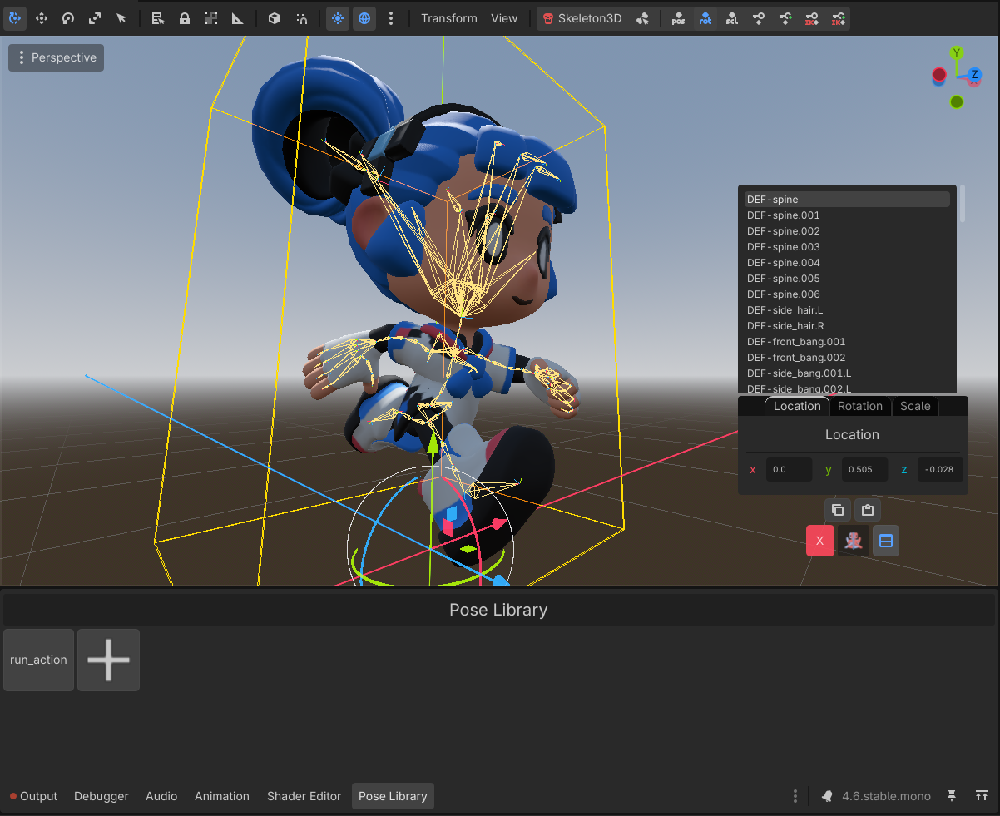

# Anim Kit

Tired Godot's current armature workflow? Well, it just got an upgrade! This plugin aims to add many features that are just missing currently, especially for animating with bones using an AnimationPlayer.

## Current features (v1.0)
| Euler Rotation Editing | Copy/Paste Transforms |
| :--- | :--- |
|  |  |
| **Pose Library** | **Full Pose Mirroring** |
|  |  |

- Bone dock for editing transforms with euler rotation editing
- Copy/paste bone transforms
- Working Pose Library for saving and loading poses
- Mirroring full poses

## Planned features
- Hide/Isolate bones
- Mirroring full animations
- More cutscene animation tools

## Installation
1. Copy the `anim_kit/` folder into your Godot project’s `addons/` folder
2. Enable the plugin in Project → Project Settings → Plugins

## Notes
If you encounter any issues or have suggestions, please open a GitHub Issue.

## License
[MIT License](LICENSE)
